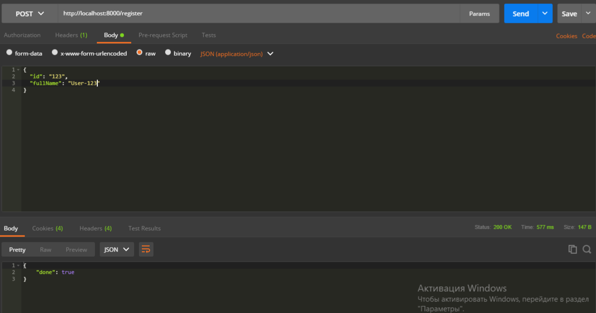
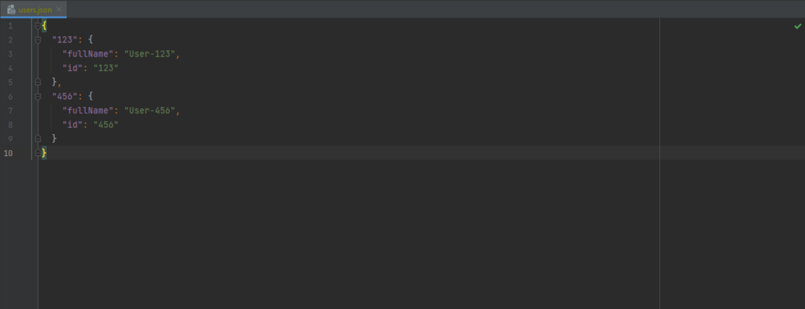
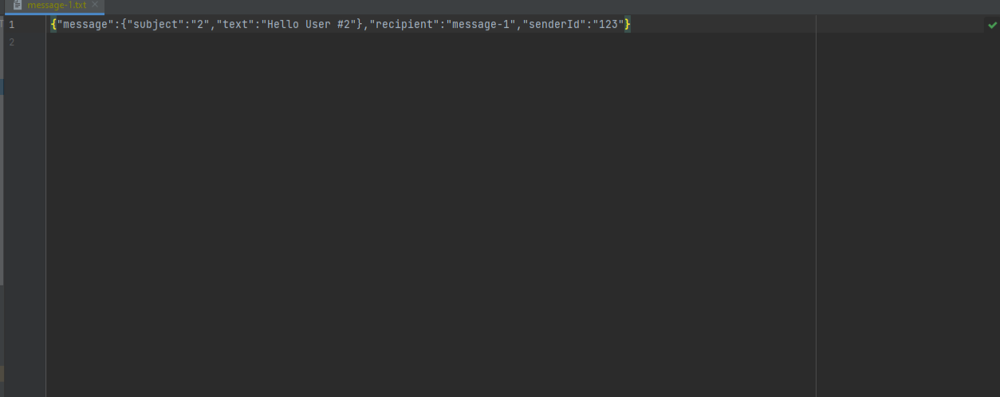

# Effective API Development for Scala/Akka based microservices

* `SBT` **(** RU **)** [sbt-ru.pdf](sbt-ru.pdf)
* `Проектирование Сервисного Слоя и Логики Приложения` https://emacsway.github.io/ru/service-layer
  * `Могут ли Akka Actors заменить сервисный слой?`: https://stackoverflow.com/questions/23276623/can-akka-actors-replace-service-layer
  * **(** `Не используйте акторов для параллелизма`: https://www.chrisstucchio.com/blog/2013/actors_vs_futures.html **)**

#### Модель актеров
* [Akka Documentation Version 2.6.17: Actor Architecture](https://doc.akka.io/docs/akka/current/typed/guide/tutorial_1.html)
  * https://docs.scala-lang.org/overviews/core/actors.html
  * https://alvinalexander.com/scala/simple-scala-akka-actor-examples-hello-world-actors
  * `Scala Frameworks > Akka Tutorials`: http://allaboutscala.com/scala-frameworks/akka
* https://www.baeldung.com/scala/typed-akka


---

1. Старт приложения `com.akkahttpexample.Application`

Sun Nov 07 10:56:46 EET 2021) Starting HTTP Server localhost:8000

2. Регистрация пользователя

POST [http://localhost:8000/register](http://localhost:8000/register)
```json
{
  "id": "123",
  "fullName": "User-123"
}
```
```json
{
    "done": true
}
```
Fri Oct 22 12:56:50 EEST 2021) Registering user 123





3. Прием сообщения для доставки

POST [http://localhost:8000/consume](http://localhost:8000/consume)
```json
{
  "senderId": "123",
  "recipient": "message-1",
  "message": {
    "subject": "2",
    "text": "Hello User #2"
  }
}
```
```json
{
  "message": "Operation accepted"
}
```

Fri Oct 22 14:23:03 EEST 2021) Message from 123 accepted




```json
{
  "senderId": "12",
  "recipient": "message-2",
  "message": {
    "subject": "#3",
    "text": "Hello User"
  }
}
```
```json
{
  "message": "Sender is not registered"
}
```

Fri Oct 22 14:44:23 EEST 2021) Message from 12 refused


---

[Ссылка на запись 11 занятия](https://us02web.zoom.us/rec/share/Eppaa_8w4RNhLcT-NWyOZLksii_6d9mw0W2F7iW9ryFA1dRVb7z5q16P-l768A_k.LAwZy0f0Brak_cuB)

**(** [https://snipboard.io](https://snipboard.io) **)**
