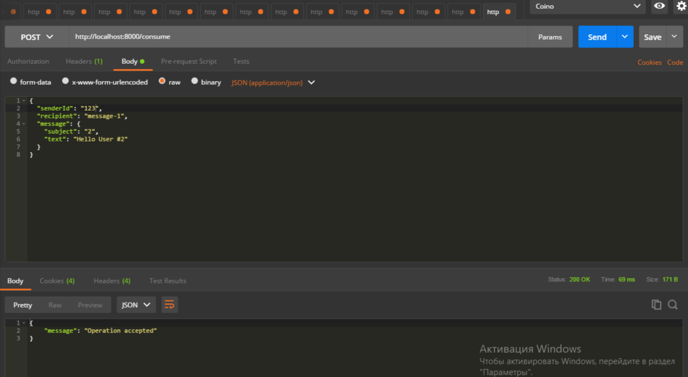
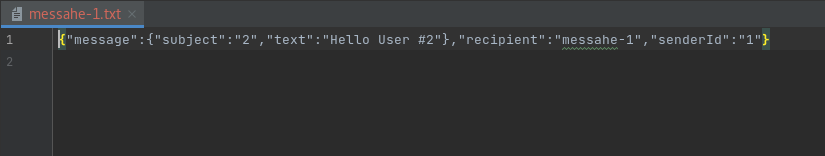

# Effective API Development for Scala/Akka based microservices

* `SBT` **(** RU **)** [sbt-ru.pdf](sbt-ru.pdf)
* `Проектирование Сервисного Слоя и Логики Приложения` https://emacsway.github.io/ru/service-layer
  * `Могут ли Akka Actors заменить сервисный слой?`: https://stackoverflow.com/questions/23276623/can-akka-actors-replace-service-layer
  * **(** `Не используйте акторов для параллелизма`: https://www.chrisstucchio.com/blog/2013/actors_vs_futures.html **)**

#### Модель актеров
* [Akka Documentation Version 2.6.17: Actor Architecture](https://doc.akka.io/docs/akka/current/typed/guide/tutorial_1.html)
  * https://docs.scala-lang.org/overviews/core/actors.html
  * https://alvinalexander.com/scala/simple-scala-akka-actor-examples-hello-world-actors
  * `Scala Frameworks > Akka Tutorials`: http://allaboutscala.com/scala-frameworks/akka
* https://www.baeldung.com/scala/typed-akka

Модель актеров один из первых раз была написана на языке 'Erlang'
'Erlang' - это язык программирования, который написали в 'Ericson' (компания, которая занимается телекоменикационным оборудованием...)
Это функциональный язык программирования, 1978г., в котором основная часть многопоточнисти была реализована чисто на Actor-ах.
Самый популярный проект, который написанный на Erlang - это RabbitMQ.

Вся наша система представлена в виде модели актеров.
У каждого актера есть свой почтовый ящик куда приходят сообщения.
Каждое сообщения из почтового ящика достается и обрабатываются в порядке FIFO.
С этим актером нельзя никаким другим способом коммуницировать кроме только как сообщение.
У этого актера есть соответствующее состояние (в памяти, как в объекте) и поменять его можно тоже только через сообщение.
Актеры могут порождать других актеров, которые им подчиняются.
Каждый актер может менять свое поведение в зависимости от того какое письмо ему пришло.

```text
Akka Framework (5-компонентов):
1. Akka Typed / Core (actor model itself)
2. Akka Cluster (one actor system on distributed machine)
3. Akka Persistence (Persistence for Even Driven Architecture)
4. Akka Streams (Alpakka - to use Kafka, RabbitMQ etc.)
5. Akka HTTP (ex. Spray, based on Akka Streams)
```

1. Модель акторов это самая быстрая многопоточная среда которую можно достигнуть на Scala.
   До версии Akka 2.5.x - это была Akka Untyped (старая, классическая Akka Core)
   С версии Akka 2.6.0 - появилась Akka Typed
2. До того когда к нам пришел Docker, сделать распределенные системы было сложно...
   Акторы могли работать вообще на разных физических машинах и даже в разных подсетях
   Появилась отдельная система: Docker, Docker Compose, Docker Swarm + Kubernetes
3. Чтобы состояние актора не пропадало - нужно записать его в базу данных (сохраняет состояние актера в базу данных)
   Когда состояние актера подымается, то все те сообщения которые ранее проходили - они проходят еще раз, и в итоге проходит еще раз все состояния от своего рождения...
   Это используется в системах где очень важно иметь возможность провести аудит, например, в платежных системах
4. Java-Rx


---

1. Старт приложения `com.akkahttpexample.Application`

Sun Nov 07 10:56:46 EET 2021) Starting HTTP Server localhost:8000

2. Регистрация пользователя

POST [http://localhost:8000/register](http://localhost:8000/register)
```json
{
  "id": "123",
  "fullName": "User-123"
}
```
```json
{
    "done": true
}
```
Fri Oct 22 12:56:50 EEST 2021) Registering user 123


3. Прием сообщения для доставки

POST [http://localhost:8000/consume](http://localhost:8000/consume)
```json
{
  "senderId": "123",
  "recipient": "message-1",
  "message": {
    "subject": "2",
    "text": "Hello User #2"
  }
}
```
```json
{
  "message": "Operation accepted"
}
```

Fri Oct 22 14:23:03 EEST 2021) Message from 123 accepted




```json
{
  "senderId": "12",
  "recipient": "message-2",
  "message": {
    "subject": "#3",
    "text": "Hello User"
  }
}
```
```json
{
  "message": "Sender is not registered"
}
```

Fri Oct 22 14:44:23 EEST 2021) Message from 12 refused




---

[Ссылка на запись 11 занятия](https://us02web.zoom.us/rec/share/Eppaa_8w4RNhLcT-NWyOZLksii_6d9mw0W2F7iW9ryFA1dRVb7z5q16P-l768A_k.LAwZy0f0Brak_cuB)

**(** [https://snipboard.io](https://snipboard.io) **)**
